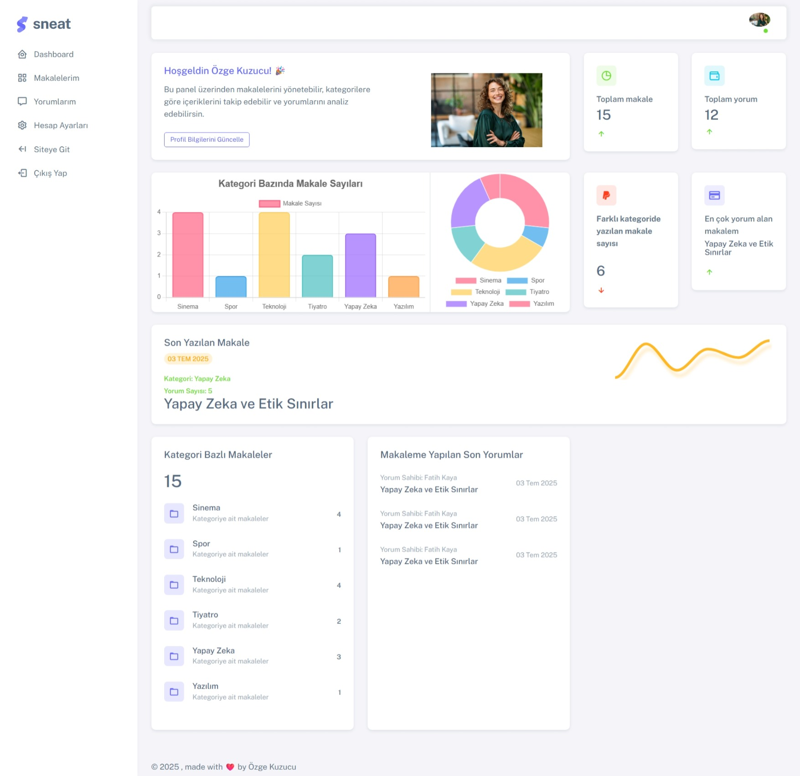
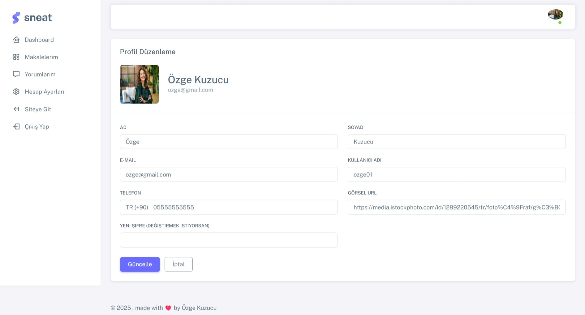
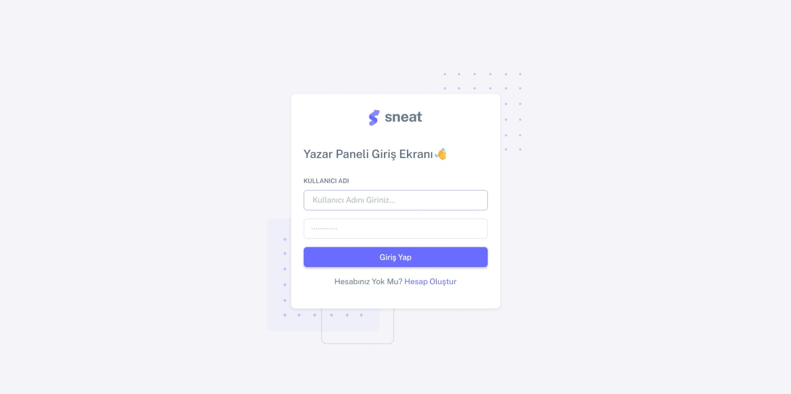
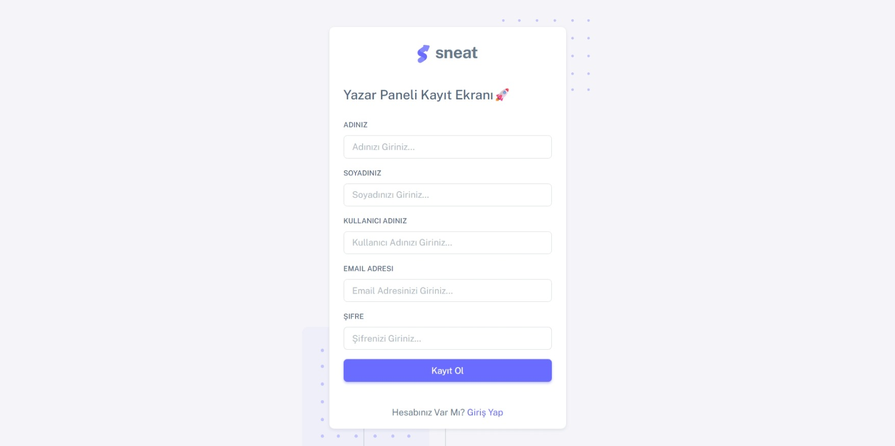
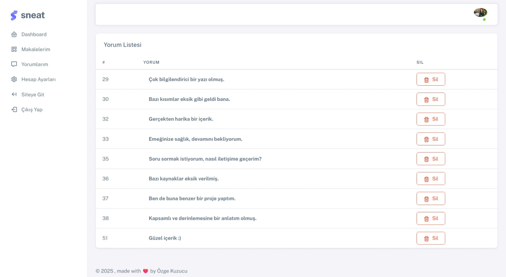
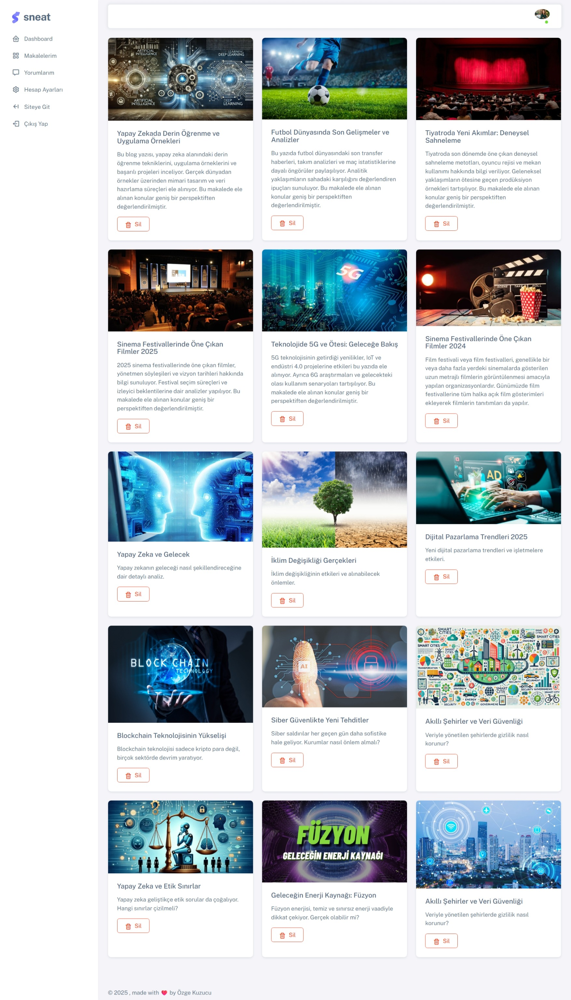
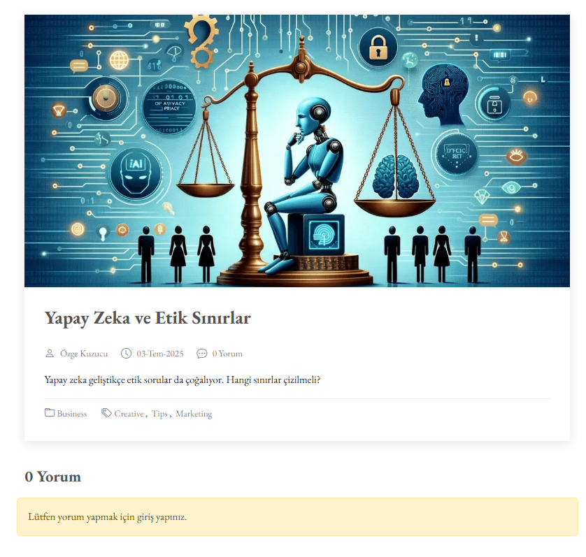
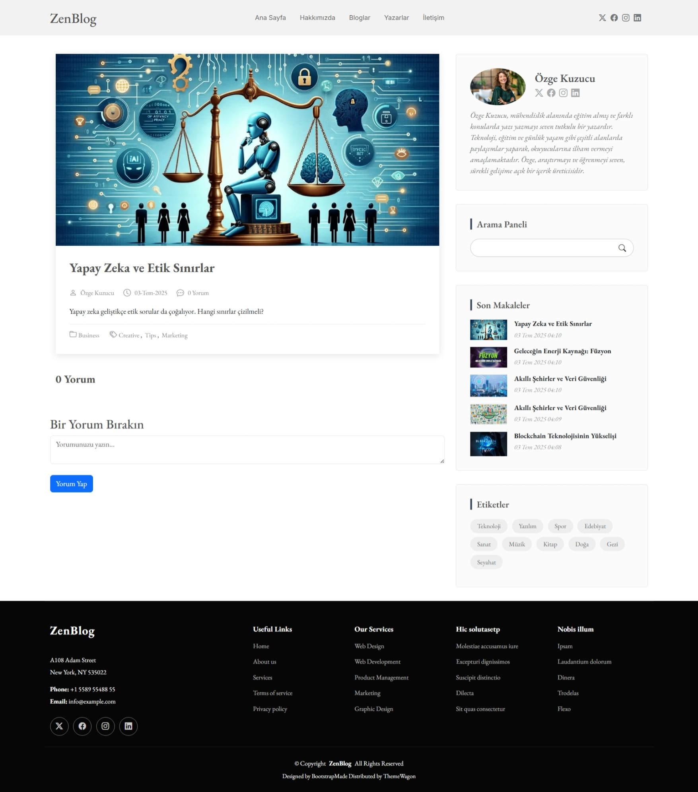
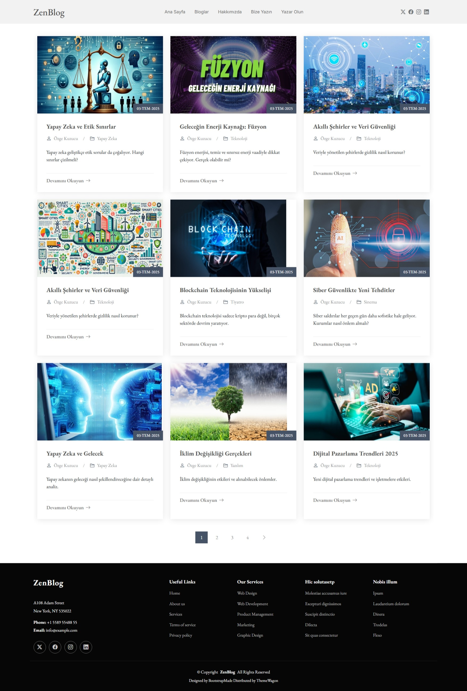
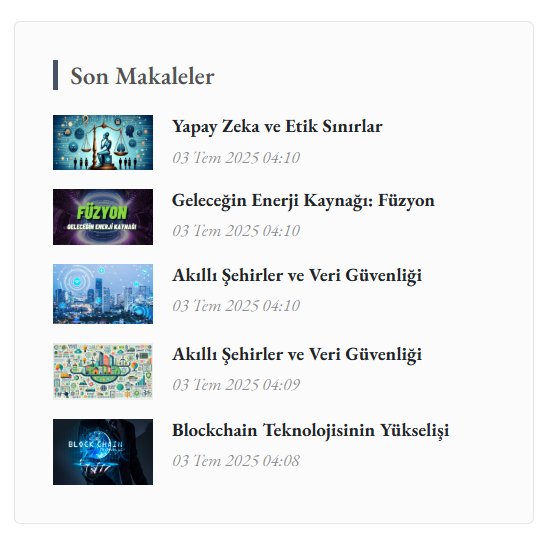

# 📖 BlogStore – Yapay Zeka Destekli ASP.NET Core MVC Blog Platformu

BlogStore, kullanıcıların içerik oluşturabildiği, yorum yapabildiği, kategori bazlı içerik takibi sağlayan ve yapay zeka destekli güvenlik mekanizmaları barındıran modern bir blog platformudur. Proje, ASP.NET Core MVC mimarisi üzerine inşa edilmiştir ve modüler yapısıyla geliştirilmeye açık bir sistem sunar.

---

## 🚀 Öne Çıkan Özellikler

### 👤 Kullanıcı Yönetimi
- ASP.NET Core Identity ile kullanıcı kaydı, girişi ve yetkilendirme
- Profil düzenleme ve görsel güncelleme
  

### ✍️ İçerik Yönetimi
- Makale ekleme, silme, güncelleme
- Kategori bazlı filtreleme
- Yazar bazlı makale listeleme
- Makale detay sayfası (Slug ile URL routing)
  

### 💬 Yorum Sistemi
- AJAX destekli yorum gönderimi (ViewComponent ile)
- **Toksik içerik analizi** (Hugging Face `unitary/toxic-bert` modeli ile)
- **Yorum çevirisi** (Hugging Face `Helsinki-NLP/opus-mt-tr-en` modeli ile)
  

### 🧠 Yapay Zeka Entegrasyonu
- İngilizce’ye çevirilen yorum metinleri üzerinden toksik içerik kontrolü
- Yorumlara toksik skor ve uyarı etiketi ekleme

### 🎨 Arayüz & Etkileşim
- Tam responsive tasarım
- Bootstrap 5, jQuery, SweetAlert2 ile etkileşimli bildirimler
- Razor View Engine, Partial View, ViewComponent mimarisi
  

## 🧰 Kullanılan Teknolojiler

| Katman         | Teknolojiler / Araçlar                                     |
|----------------|------------------------------------------------------------|
| Backend        | ASP.NET Core 9.0, Entity Framework Core, C# 10             |
| Frontend       | Razor View Engine, HTML, CSS, Bootstrap 5, jQuery          |
| Veritabanı     | Microsoft SQL Server                                       |
| Güvenlik       | ASP.NET Core Identity, Cookie Authentication               |
| AI Servisleri  | Hugging Face API (ToxicBERT, TR-EN Çeviri Modeli)          |
| Bildirim       | SweetAlert2                                                |
| Grafik / UI    | Chart.js (İstatistik paneli için)                          |

---
## 🎯 Kazanımlarım

Bu proje sayesinde aşağıdaki teknik ve pratik becerileri kazandım:

- ✅ **ASP.NET Core MVC** mimarisi ile dinamik web uygulaması geliştirme
- ✅ **Katmanlı Mimari (Layered Architecture)** prensibiyle temiz ve sürdürülebilir kod yazma
- ✅ **Entity Framework Core** kullanarak veritabanı işlemlerini yönetme
- ✅ **ASP.NET Core Identity** ile kullanıcı kimlik doğrulama ve yetkilendirme uygulama
- ✅ **ViewComponent**, **PartialView**, **AJAX** ve **jQuery** ile modern kullanıcı etkileşimleri oluşturma
- ✅ **SweetAlert2** kullanarak kullanıcı dostu bildirim sistemleri geliştirme
- ✅ **Hugging Face API** kullanarak yapay zeka destekli içerik analizi gerçekleştirme:
  - ⚠️ Toksik yorum algılama (ToxicBERT)
  - 🌐 Yorum çeviri entegrasyonu (TR → EN)
- ✅ **Asenkron programlama** (async/await) ile performanslı işlemler gerçekleştirme
- ✅ **Git ve GitHub** ile versiyon kontrolü sağlama ve açık kaynak proje yönetimi

> 💡 Bu proje; gerçek bir blog sistemi geliştirirken aynı zamanda modern yazılım geliştirme pratiklerini öğrenmemi ve uygulamamı sağladı.

